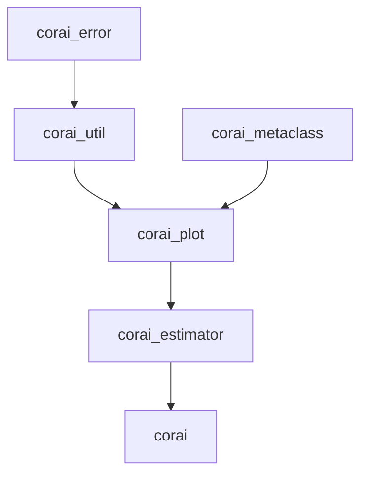

# CorAI

### Available version

* *version 1.303*: Release in November 2021. The name of the library changed, most objects are simply exposed at the
  surface of the import. Pip downloading incorporated.
* *version 1.304*: Release in January 2022. Dependencies to other libraries are lowered for increased compatibility.
* *version 1.400*: Release in March 2022. In this version, the library should have mostly correct utilities, and we
  incorporated the usage of PyTorch Lightning into the functionalities of CorAI. Lightning avoids some boiler plates and
  has the same ideas as we had in CorAI, so we decide to reuse it.
* *version 1.600* : Expected release: Winter 2023. 3D plots.

### General information

The aim of this repository is to automatise and optimise classical python routines. We detail here the different
directories available.

Some functions are simple classical routines. Other files offer more advanced code, involving wrappers classes, classes
objects, metaclasses…

Finally, we are trying to incorporate some C++ routines in the code for very efficient code. This part is still in the
project phase.

### How to use the Library?

    pip install corai>=1.400

If the server does not have access to this module, one can download it by hand with:

    git clone https://github.com/Code-Cornelius/CorAI.git

### Structure of the Project and how to import

The main structure is the following:

```
Project
├── corai_error 
│  ├── src
│  │  ├── error_convergence.py
│  │  ├── error_not_allowed_input.py
│  │  ├── error_not_enough_information.py
│  │  ├── error_not_yet_allowed.py
│  │  ├── error_type_setter.py
│  │  ├── numpy_function_used.py  (not really interesting for general purpose)
│  │  └── warning_deprecated.py
│  └── tests
│
├── corai_estimator 
│  ├── src
│  │  ├── estimator
│  │  │  └── estimator.py
│  │  └── plot_estimator
│  │     ├── distplot_estimator.py
│  │     ├── plot_estimator.py
│  │     └── relplot_estimator.py
│  └── tests
│
├── corai_metaclass 
│  ├── src
│  │  └── register
│  │     ├── deco_register.py
│  │     └── register.py
│  └── tests
│
// corai, visible below
|
├── corai_plot 
│  ├── src
│  │  ├── acolor
│  │  │  ├── acolorsetcontinuous.py
│  │  │  ├── acolorsetdiscrete.py
│  │  │  └── colors_seaborn.py
│  │  └── aplot
│  │     ├── aplot.py
│  │     └── dict_ax_for_aplot.py
│  └── tests
│
└── corai_util 
   ├── calculus
   │  ├── src
   │  │  ├── diff_eq.py
   │  │  ├── integration.py
   │  │  └── optimization.py
   │  └── tests
   ├── finance
   │  ├── src
   │  │  ├── bs_model.py
   │  │  ├── financials.py
   │  │  ├── implied_vol.py
   │  │  └── param_iv.py
   │  └── tests
   ├── ML  
   │  ├── src
   │  │  └── networkx_fct.py
   │  └── tests
   └── tools
      ├── src
      │  ├── benchmarking.py
      │  ├── decorator.py
      │  ├── function_dict.py
      │  ├── function_file.py
      │  ├── function_iterable.py
      │  ├── function_recurrent.py
      │  ├── function_json.py
      │  ├── function_str.py
      │  ├── function_writer.py
      │  └── operator.py
      └── tests
```

However, one can import the meaningful objects in the following way, where one `from path import object`:

```
Project
├── corai_error 
│  ├── error_convergence.py
│  ├── error_not_allowed_input.py
│  ├── error_not_enough_information.py
│  ├── error_not_yet_allowed.py
│  ├── error_type_setter.py
│  └── deprecated_function.py
│
├── corai_estimator 
│  ├── Estimator
│  ├── Distplot_estimator
│  ├── Plot_estimator
│  └── Relplot_estimator
│
├── corai
│  ├── (architecture)
│  │  ├── One_hidden_recurrent
│  │  ├── RNN, factory_parametrised_RNN
│  │  ├── Two_hidden_recurrent
│  │  ├── Savable_net
│  │  ├── Residual_split
│  │  ├── Reshape
│  │  ├── Fully_connected_NN, factory_parametrised_FC_NN
│  │  ├── Free_NN, factory_parametrised_Free_NN
│  │  └── Conv2dLSTMCell
│  ├── (estimator)
│  │  ├── Estim_history
│  │  ├── Plot_estim_history
│  │  ├── Relplot_history
│  │  ├── Relplot_hyper_param
│  │  ├── Estim_hyper_param
│  │  ├── Distplot_hyper_param
│  │  └── Plot_estim_hyper_param
│  ├── Metric
│  ├── (training_stopper)
│  │  ├── Early_stopper
│  │  ├── Early_stopper_training
│  │  ├── Early_stopper_validation
│  │  └── Early_stopper_vanilla
│  ├── (pytorch_lightning = pl)
│  │  ├── History_dict
│  │  └── Progressbar_without_val_batch_update
│  ├── FastTensorDataLoader
│  ├── Optim_wrapper
│  ├── Windowcreator
│  ├── nn_fit
│  ├── nn_kfold_train, initialise_estimator, train_kfold_a_fold_after_split
│  ├── NNTrainParameters
│  ├── nn_train
│  ├── nn_plots.py
│  ├── data_processing_fct.py
│  ├── methods_train.py
│  └── util_train.py
│
├── corai_metaclass 
│  ├── deco_register.py
│  └── register.py
│
├── corai_plot 
│  ├── APlot
│  ├── AColorsetContinuous
│  └── AColorsetDiscrete
│
└── corai_util 
   ├── calculus
   │  ├── diff_eq.py
   │  ├── integration.py
   │  └── optimization.py
   ├── finance
   │  ├── bs_model.py
   │  ├── financials.py
   │  ├── implied_vol.py
   │  └── param_iv.py
   ├── ML  
   │  └── networkx_fct.py
   └── tools
      ├── benchmarking.py
      ├── decorator.py
      ├── function_dict.py
      ├── function_file.py
      ├── function_iterable.py
      ├── function_json.py
      ├── function_recurrent.py
      ├── function_str.py
      ├── function_writer.py
      └── operator.py
```

a) For example, in order to import `benchmarking.py`, one should write:  `from corai_util.tools import benchmarking`.

Also, the corai libraries are codependent in the following way:



* All libraries start with the name `corai_{NAME LIBRARY}`, except for the machine learning / pytorch library, which is
  just corai.

In the future we will explain better how to use imports. For now, everything is exposed in `corai`and in the other
library, you might have to import the module first in this fashion:

```
from corai import module
or
from corai.extension import module
```

Then, the functions written in the module are callable with:

```
module.function()
```

if one wants to simply use the name of the function without referring to the private call table of the library, one can
write:

```
function = module.function

function()
```

## corai_error

Custom errors for better handling of errors in the library. They all inherit from the built-in exception and intends to
make the code clearer.

* **Error_convergence** inherits from Exception,
* **Error_not_allowed_input** inherits from ValueError,
* **Error_not_enough_information** inherits from ValueError,
* **Error_not_yet_allowed** inherits from ValueError,
* **Error_type_setter** inherits from TypeError,
* **Warning_deprecated** function that rise a deprecation warning.

## corai_estimator

* **Estimator** : A class that intends to make dataframes more accessible.
* **Plotters** : Classes of objects that extend the behavior of seaborns' in-built functions. We used seaborn's names
  for the classes and methods. We rely on polymorphism to adapt behavior of general functions to each case's need.

## corai_metaclass

Metaclasses are most the times unnecessary. However, in some cases, they carry the exact idea needed for some design.
For now, we only use metaclasses for `APlot`, where it allows a registration pattern for all plots.

## corai

It should be imported as the alias: `corai`, as a reference to Cornelius AI. It is possible to use all the functions and
tools (everything is exposed to the root) by using `corai.name_fct`. However, if one wants to be clearer in the code,
one can also use `corai.folder.name_fct` as it is exposed in the structure above.

## corai_plot

`colors_seaborn.py` gives a presentation of the different (personal) favorite palette of seaborn.

## corai_util

We created two original objects.

* **APlot** : A class that simplifies drawing using the library matplotlib ; 
