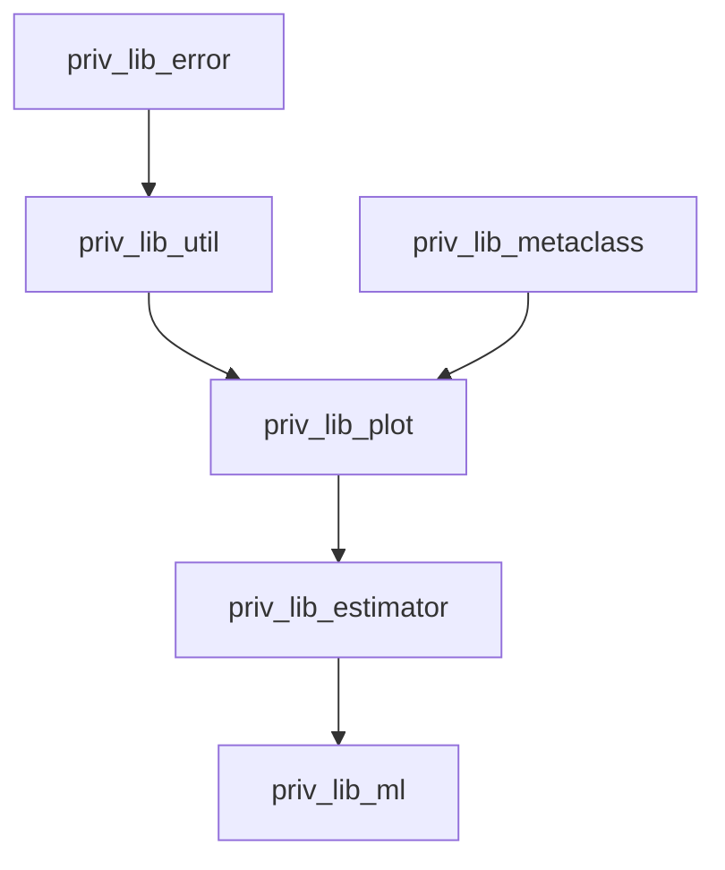

# Python Personal Libraries

### Available version

* *version 1.000* :  Released in September 2020. 
It was released in order for me to have a stable version that was compatible with my summer projects. 
There is still a lot to do on it. 
* *version 1.142* : Released in June 2021. 
The library is better documented, and better structured.
It is now separated in the corresponding libraries, and there are tests for most of the functions.
* *version 1.600* : Expected release: Winter 2022.
Incorporate new financial functions, 3D plots as well as neural networks functions. 
Estimator reworked. 


### General information

The aim of this repository is to automatise and optimise classical python routines. 
We detail here the different directories available, which depends on the intended usage. 

Some functions are simple classical routines. 
Other files offer more advanced code, involving wrappers classes, classes objects, metaclasses…

Finally, we are trying to incorporate some C++ routines in the code for very efficient code. This part is still in the project phase.
 
### Where to put the Library?
One should download the latest version and add the path to it to the interpreter before running code.
The easiest way to use the libraries would be to put the library folders at the root of the project. 
It is not possible to only download part of a library, as there might be some dependencies.

### Structure of the Project and how to import

The main structure is the following:
```
Project
├── priv_lib_error 
│  ├── src
│  │  ├── error_convergence.py
│  │  ├── error_not_allowed_input.py
│  │  ├── error_not_enough_information.py
│  │  ├── error_not_yet_allowed.py
│  │  ├── error_type_setter.py
│  │  ├── numpy_function_used.py  (not really interesting for general purpose)
│  │  └── warning_deprecated.py
│  └── tests
│
├── priv_lib_estimator 
│  ├── src
│  │  ├── estimator
│  │  │  └── estimator.py
│  │  └── plot_estimator
│  │     ├── distplot_estimator.py
│  │     ├── plot_estimator.py
│  │     └── relplot_estimator.py
│  └── tests
│
├── priv_lib_metaclass 
│  ├── src
│  │  └── register
│  │     ├── deco_register.py
│  │     └── register.py
│  └── tests
│
├── priv_lib_ml
│  ├── src
│  │  ├── classes
│  │  │  ├── architecture
│  │  │  │  ├── rnn
│  │  │  │  │  ├── gru.py
│  │  │  │  │  ├── lstm.py
│  │  │  │  │  └── rnn.py
│  │  │  │  ├── conv2dlstm.py
│  │  │  │  ├── free_nn.py
│  │  │  │  ├── fully_connected.py
│  │  │  │  ├── reshape.py
│  │  │  │  ├── residual_split.py
│  │  │  │  └── savable_net.py
│  │  │  ├── estimator
│  │  │  │  ├── history
│  │  │  │  │  ├── estim_history.py
│  │  │  │  │  ├── plot_estim_history.py
│  │  │  │  │  └── relplot_history.py
│  │  │  │  └── hyper_parameters
│  │  │  │     ├── distplot_hyper_param.py
│  │  │  │     ├── estim_hyper_param.py
│  │  │  │     ├── plot_estim_hyper_param.py
│  │  │  │     └── relplot_hyper_param.py
│  │  │  ├── metric
│  │  │  │  └── metric.py
│  │  │  ├── training_stopper
│  │  │  │  ├── early_stopper.py
│  │  │  │  ├── early_stopper_training.py
│  │  │  │  ├── early_stopper_validation.py
│  │  │  │  └── early_stopper_vanilla.py
│  │  │  ├── fast_tensor_dataloader.py
│  │  │  ├── optim_wrapper.py
│  │  │  └── windowcreator.py
│  │  ├── plot
│  │  │  └── nn_plots.py
│  │  ├── train
│  │  │  ├── fit.py
│  │  │  ├── kfold_training.py
│  │  │  ├── nntrainparameters.py
│  │  │  └── train.py
│  │  ├── data_processing_fct.py
│  │  ├── methods_train.py
│  │  └── util_train.py
│  └── tests
│
├── priv_lib_plot 
│  ├── src
│  │  ├── acolor
│  │  │  ├── acolorsetcontinuous.py
│  │  │  ├── acolorsetdiscrete.py
│  │  │  └── colors_seaborn.py
│  │  └── aplot
│  │     ├── aplot.py
│  │     └── dict_ax_for_aplot.py
│  └── tests
│
└── priv_lib_util 
   ├── calculus
   │  ├── src
   │  │  ├── diff_eq.py
   │  │  ├── integration.py
   │  │  └── optimization.py
   │  └── tests
   ├── finance
   │  ├── src
   │  │  ├── bs_model.py
   │  │  ├── financials.py
   │  │  ├── implied_vol.py
   │  │  └── param_iv.py
   │  └── tests
   ├── ML  
   │  ├── src
   │  │  └── networkx.py
   │  └── tests
   └── tools
      ├── src
      │  ├── benchmarking.py
      │  ├── decorator.py
      │  ├── function_dict.py
      │  ├── function_file.py
      │  ├── function_iterable.py
      │  ├── function_recurrent.py
      │  ├── function_json.py
      │  ├── function_str.py
      │  ├── function_writer.py
      │  └── operator.py
      └── tests
```

However, one can import the meaningful objects in the following way, where one `from path import object`:


```
Project
├── priv_lib_error 
│  ├── error_convergence.py
│  ├── error_not_allowed_input.py
│  ├── error_not_enough_information.py
│  ├── error_not_yet_allowed.py
│  ├── error_type_setter.py
│  └── deprecated_function.py
│
├── priv_lib_estimator 
│  ├── estimator.py
│  ├── plot_estimator.py
│  ├── distplot_estimator.py
│  └── relplot_estimator.py
│
├── priv_lib_ml
│  ├── architecture
│  │  ├── rnn
│  │  │  ├── gru.py
│  │  │  ├── lstm.py
│  │  │  └── rnn.py
│  │  ├── conv2dlstm.py
│  │  ├── free_nn.py
│  │  ├── fully_connected.py
│  │  ├── reshape.py
│  │  ├── residual_split.py
│  │  └── savable_net.py
│  ├── estimator
│  │  ├── estim_history.py
│  │  ├── plot_estim_history.py
│  │  └── relplot_history.py
│  │  ├── distplot_hyper_param.py
│  │  ├── estim_hyper_param.py
│  │  ├── plot_estim_hyper_param.py
│  │  └── relplot_hyper_param.py
│  ├── metric.py
│  ├── training_stopper
│  │  ├── early_stopper.py
│  │  ├── early_stopper_training.py
│  │  ├── early_stopper_validation.py
│  │  └── early_stopper_vanilla.py
│  ├── fast_tensor_dataloader.py
│  ├── optim_wrapper.py
│  └── windowcreator.py
│  ├── plot
│  │  └── nn_plots.py
│  ├── train
│  │  ├── fit.py
│  │  ├── kfold_training.py
│  │  ├── nntrainparameters.py
│  │  └── train.py
│  ├── data_processing_fct.py
│  ├── methods_train.py
│  └── util_train.py
│
├── priv_lib_metaclass 
│  ├── deco_register.py
│  └── register.py
│
├── priv_lib_plot 
│  ├── aplot.py
│  ├── acolorsetdiscrete.py
│  └── acolorsetcontinuous.py
│
└── priv_lib_util 
   ├── calculus
   │  ├── diff_eq.py
   │  ├── integration.py
   │  └── optimization.py
   ├── finance
   │  ├── bs_model.py
   │  ├── financials.py
   │  ├── implied_vol.py
   │  └── param_iv.py
   ├── ML  
   │  └── networkx.py
   └── tools
      ├── benchmarking.py
      ├── decorator.py
      ├── function_dict.py
      ├── function_file.py
      ├── function_iterable.py
      ├── function_json.py
      ├── function_recurrent.py
      ├── function_str.py
      ├── function_writer.py
      └── operator.py
```


For example, in order to import `benchmarking.py`, one should write:  `from priv_lib_util.tools import benchmarking`

Also, the priv_lib are codependent in the following way:



Meaning one can download only part of the library by keeping these relationships in mind.

* All libraries start with the name `priv_lib_{NAME LIBRARY}`,
inside each library,  there is a source folder and a test folder. In order to import any module, one should simply write:

```
from priv_lib import module
or
from priv_lib.extension import module
```

Then, the functions written in the module are callable with:

```
module.function()
```

if one wants to simply use the name of the function without referring to the private call table of the library, one can write:

```
function = module.function

function()
```


## library_errors

Custom errors for better handling of errors in the library. They all inherit from the built-in exception and intends to make the code clearer.

* **Error_convergence** inherits from Exception,
* **Error_not_allowed_input** inherits from ValueError,
* **Error_not_enough_information** inherits from ValueError,
* **Error_not_yet_allowed** inherits from ValueError,
* **Error_type_setter** inherits from TypeError,
* **Warning_deprecated** function that rise a deprecation warning.

## priv_lib_estimator

* **Estimator** : A class that intends to make dataframes more accessible.
* **Plotters** : Classes of objects that extend the behavior of seaborns' in-built functions. 
  We used seaborn's names for the classes and methods. 
  We rely on polymorphism to adapt behavior of general functions to each case's need.
  
## priv_lib_metaclass
Metaclasses are most the times unnecessary. However, in some cases, they carry the exact idea needed for some design. 
For now, we only use metaclasses for `APlot`, where it allows a registration pattern for all plots.

## priv_lib_ML

## priv_lib_plot

`colors_seaborn.py` gives a presentation of the different (personal) favorite palette of seaborn.
## priv_lib_util


We created two original objects. 

* **APlot** : A class that simplifies drawing using the library matplotlib ; 
