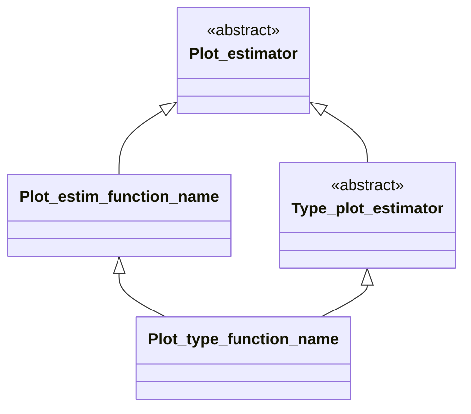
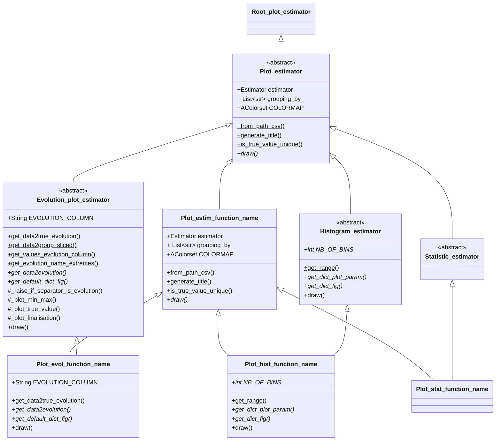
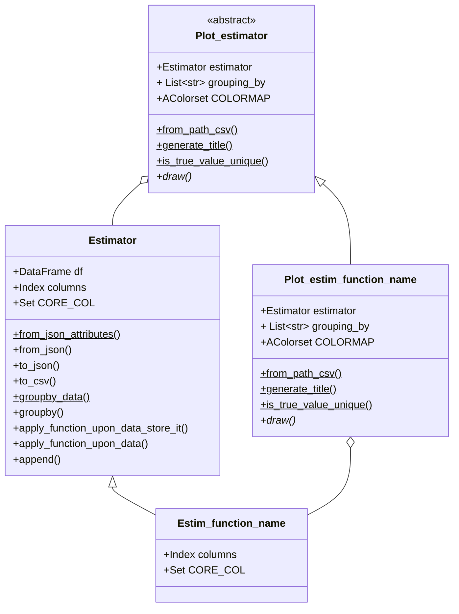

This is a tutorial on the how to use the classes from this library.

Estimators and Plotters are an efficient way to use dataframes. Dataframes from pandas are simple containers that lack
some global structure and efficient ways to plot data. In order to fill this gap, estimators are wrappers around
dataframes that $ allow storing metadata and grant some useful methods. Also, sometimes dataframe's extremely flexible
structure shall be restricted and one would wish to enforce a given pattern for all dataset of the same type. This is
doable with estimators.

On the other hand, plotters contain estimators and offer an automatic way to plot certain type of representation of the
data.

# ESTIMATORS

# ESTIM. PLOTTERS
todo : the order of inheritance has some importance. It has an impact at ....
The convention is:

Class | Naming Convention | 
------------ | ------------ |
Estimator Child Class                   | Estim_function_name | 
Plot_estimator Child Class              | Plot_estim_function_name | 
Evolution_plot_estimator Child Class    | Plot_evol_function_name | 
Histogram_estimator Child Class         | Plot_hist_function_name | 
Statistic_estimator Child Class         | Plot_stat_function_name | 

Mermaid diagrams: https://mermaid-js.github.io/mermaid/#/
Easily instalable in Pycharm.

We follow UML class diagrams: https://mermaid-js.github.io/mermaid/#/classDiagram
https://en.wikipedia.org/wiki/Class_diagram

'*' means abstract, '$' means static or class method.

### Basic Structure diagram of the plotter. 

Typical diamond form where the left wing (Plot_estim_function_name) indicates the common behavior of plotting 
a certain function, and the right wing (Type_plot_estimator) indicates the way to plot such type of plot.

### Global Scheme, three types of plotters represented: evolution, histogram, statistic.

### Relationship estimator and plotters.

[comment]: <> (Statistic_estimator:       -int sizeInFeet Statistic_estimator:       -canEat&#40;&#41;)

[comment]: <> (Statistic_estimator:       +int age Statistic_estimator:       +String gender Statistic_estimator:       +isMammal&#40;&#41;)

[comment]: <> (Statistic_estimator:       +mate&#40;&#41;       )
